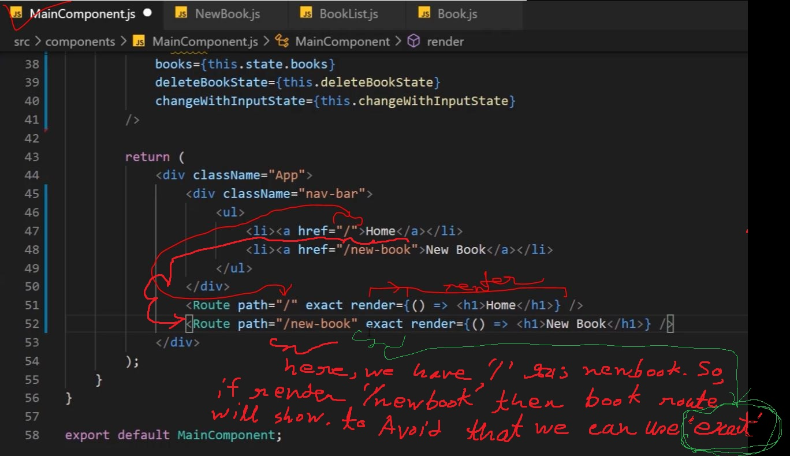
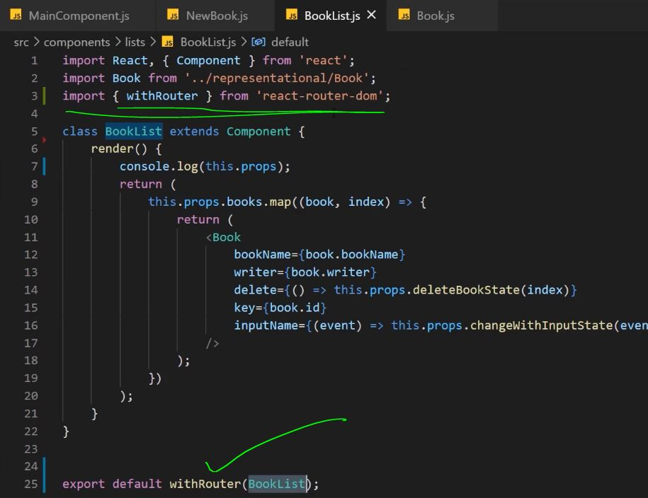
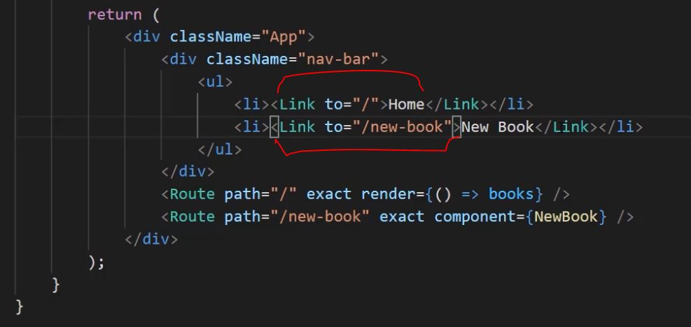
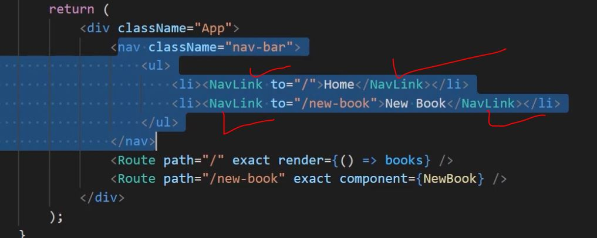
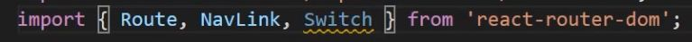

### react-router-basic : 

<hr>

# 1st:  install packages: react-router, react-router-dom.
```
npm install --save react-router react-router-dom
```
# 2. need to make the whole app under the router:
```
1. go to the App.js
2. import {BrowserRouter} from 'react-router-dom';
3. Now, supply the main/ root component as react router.
4. So, we applied the browser router at root component.
```


# 3. Now, we can use route in the whole react-app
# 4. Now, at the page--> where want to set route: most simple
### exact--> then exactly matches: The exact param disables the partial matching for a route and makes sure that it only returns the route if the path is an EXACT match to the current url. (makes it strict)
```
import {Route} from 'react-router-dom';

```


# 5. pass component using 'render' function  with route:


# 6. pass component using 'component' prop with route:


### a. When using component to pass: the route function passese some extra info about routing
### b. if we want to see the same information for Booklist then: 'withRouter' need to be used


# 7. Stop reload. swithc option without reloading whole page. 'link' component:
### using link component --> we can make the page more dynamic. it will only load the changes, not the whole page.
```
1. Use <link>  or <Nav-Link> in stead of <a> 
2. Here, instead of 'href' we need to use 'to'. 
```



# 8. Stop reload. swithc option without reloading whole page. 'NavLink' component: (like 'Link')
### using NavLink component --> we can make the page more dynamic. it will only load the changes, not the whole page.



# 9. route from obj link. make each obj as link
 

## Now, see object id on url with the passed link: (but this thing has a better solution. step 10)


# 10. switch: import switch, and take all route inside the switch. 
### first see video about switch in this reposetory.
### switch never call route more than one at a time. 



# 11. Redirect: easy.
## see the video with this reposetory.
```
1. import redirect form react dom
2. structure
      <Redirect from="/" to="/books" />
      // It means: some one tries to go "/" and he will be directed to '/books'
```

